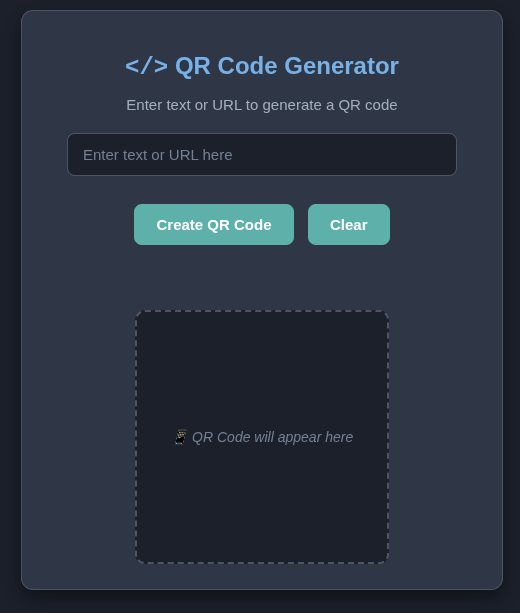

# QR Code Generator 🌐

A lightweight QR code generator that runs entirely in your browser - no server required!

## Features ✨
- Generate QR codes from text or URLs
- Works offline after initial load
- Zero data collection or tracking
- Dark mode friendly UI
- Mobile responsive design

## How to Use 🚀
1. Open [index.html](index.html) in any modern browser
2. Enter text or a URL in the input field
3. Click "Create QR Code"
4. Right-click the QR code to save or print

## Requirements ✅
- Any modern browser (Chrome, Firefox, Edge, Safari)
- Internet connection (first load only)

## Technical Details ⚙️
- Built with [PyScript](https://pyscript.net)
- Uses [Segno](https://segno.readthedocs.io) QR library
- Fallback to external API when needed
- 100% client-side processing

## Contributing 🤝
Bug reports and feature requests are welcome! Please open an issue.

## License 📄
This project is licensed under the [MIT License](LICENSE)

## **📌 Policy Links**  
- [Full Privacy Policy](PRIVACY.md)  
- [Terms of Service](TERMS.md)  
